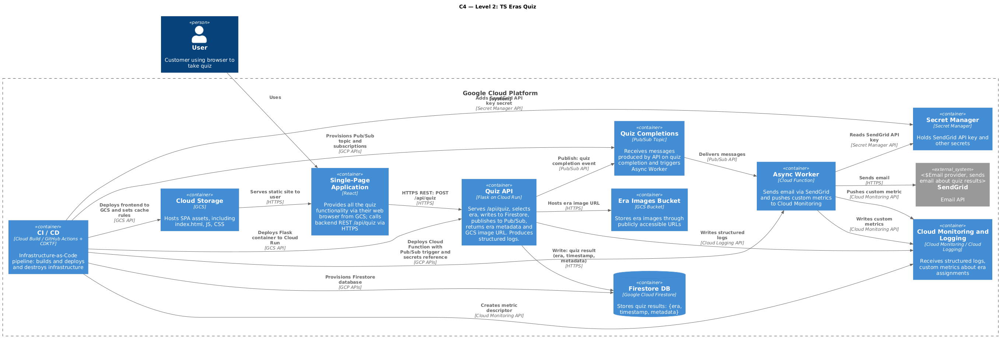

# TS Eras Quiz — Cloud-Based Web Application

This project is a serverless, event-driven web application hosted on **Google Cloud Platform (GCP)**.  
A user clicks a button and is randomly assigned a **Taylor Swift Era** (Fearless, Speak Now, Red, 1989, Reputation, Lover, Folklore, Evermore, Midnights, TTPD, The Life of a Showgirl).  
Each quiz completion triggers background processing, email notification, and observability metrics.

The project is intentionally designed to be:

- **Fully automated using Infrastructure as Code (CDKTF)**
- **Built using React (frontend) + Flask (backend)**

---

# Features

### Frontend (React)

- Static Single Page Application (SPA)
- Hosted on **Google Cloud Storage**
- Communicates with backend via REST API

### Backend (Flask)

- Serves `/api/quiz` endpoint
- Hosted on **Cloud Run**
- Randomly selects an era
- Stores quiz results in Firestore
- Returns metadata including a GCS-hosted era image URL
- Publishes Pub/Sub message for async processing
- Produces structured logs

### Background Processing

- **Pub/Sub** topic receives events about quiz completions
- **Cloud Function** sends email via SendGrid API
- Cloud Function pushes **custom metrics**:
  - `custom.googleapis.com/ts/era_assignments`  
    Label: `era="<era-name>"`

### Storage

- **GCS bucket** stores images for each Taylor Swift Era
- **Firestore** holds quiz results and timestamps

### Observability

- Application logs from Cloud Run
- Custom metric tracking how often each Era is assigned

# C4 Model — Level 2

